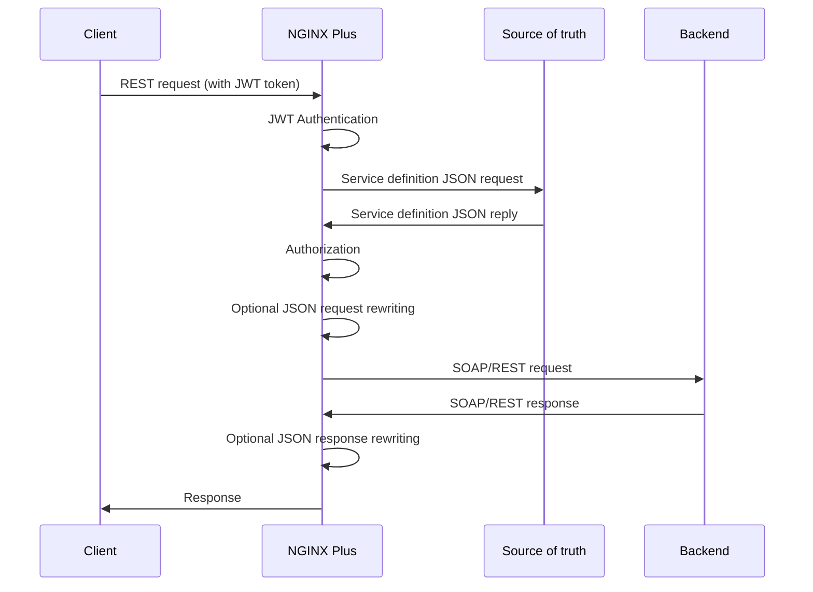

# NGINX API Steering

## Description

This is a sample NGINX Plus API Gateway configuration to publish REST APIs and provide:

- Authentication based on Java Web Tokens (JWT)
- Authorization based on HTTP method and JWT role match
- Reverse proxying with URL rewriting
- Template-based JSON payload manipulation (client-to-server and server-to-client)

An external REST API-enabled backend is used to store JSON service definitions that include authorization and rewriting rules.
The service definition JSON is defined as:

```
  {
    "id": 2,                                        <-- Unique ID
    "enabled": true,                                <-- Flag to enable/disable the definition
    "uri": "v1.0/api_post",                         <-- URI to match against client request
    "matchRules": {
      "method": "POST",                             <-- HTTP method to match against client request
      "roles": "devops"                             <-- JWT role to match
    },
    "operation": {
      "url": "https://10.5.0.12:5000/echo_data"     <-- URL to reverse proxy the client request
    },
    "json": {                                       <-- JSON payload manipulation (optional)
      "to_server": {                                <-- client-to-server payload manipulation rules
        "set": [                                    <-- key:value array to add/replace in request JSON payload
          {
            "field1": "value1"
          },
          {
            "field2": "value2"
          }
        ],
        "del": [                                    <-- Array of keys to delete from request JSON payload
          "group"
        ]
      },
      "to_client": {                                <-- server-to-client payload manipulation rules
        "set": [                                    <-- key:value array to add/replace in response JSON payload
          {
            "new_response_field": "ADDED"
          } 
        ],
        "del": [                                    <-- Array of keys to delete from response JSON payload
          "hostname"
        ]
      }
    }
  }
```

The provided sample backend can be queried using the request URI as the lookup key.
The sample backend provides the `jwks.json` endpoint to return the JWT secret.

## Prerequisites

- Linux VM with Docker-compose v2.20.3+ (tested on Ubuntu 20.04 and 22.04)
- NGINX Plus certificate and key to build the relevant docker image (tested with NGINX Plus R30-p1)

## High level architecture



## Deploying this repository

1. Clone the repository

```
git clone https://github.com/fabriziofiorucci/NGINX-API-Steering
```

2. cd to the newly created directory

```
cd NGINX-API-Steering
```

3. Run the startup script to build all docker images and spin up the docker-compose deployment. You will need to use a valid NGINX Plus certificate and key to fetch all software packages from the NGINX private registry

```
$ ./nginx-api-steering.sh -o start -C /etc/ssl/nginx/nginx-repo.crt -K /etc/ssl/nginx/nginx-repo.key[+] Running 5/5
 ✔ Network nginx-api-steering_lab-network  Created        0.3s
 ✔ Container api-server-1                  Started        0.9s
 ✔ Container api-server-2                  Started        0.9s
 ✔ Container nginx                         Started        0.9s
 ✔ Container backend                       Started        0.9s
```

4. Check running containers:

```
$ docker ps
CONTAINER ID   IMAGE                COMMAND                  CREATED          STATUS          PORTS                                                                                  NAMES
3f6f53f9786d   nginx-api-steering   "nginx -g 'daemon of…"   45 seconds ago   Up 43 seconds   0.0.0.0:10080->80/tcp, :::10080->80/tcp, 0.0.0.0:20080->8080/tcp, :::20080->8080/tcp   nginx
998ddb007210   api-server           "python apiserver.py"    45 seconds ago   Up 43 seconds   0.0.0.0:5001->5000/tcp, :::5001->5000/tcp                                              api-server-1
bd13b5e4ecf1   api-server           "python apiserver.py"    45 seconds ago   Up 43 seconds   0.0.0.0:5002->5000/tcp, :::5002->5000/tcp                                              api-server-2
46f25f772f63   backend              "python backend.py"      45 seconds ago   Up 43 seconds   0.0.0.0:10000->5000/tcp, :::10000->5000/tcp                                            backend
```


## NGINX Plus dashboard

Using your favourite browser open https://127.0.0.1:20080/dashboard.html

## Creating JWT tokens

(see https://www.nginx.com/blog/authenticating-api-clients-jwt-nginx-plus/)

This repository's backend DB uses a JWT secret defined as

```
$ cat jwt/jwks.json
{
  "keys": [
    {
      "k":"ZmFudGFzdGljand0",
      "kty":"oct",
      "kid":"0001"
    }
  ]
}
```

the k field is the generated symmetric key (base64url-encoded) basing on a secret (fantasticjwt in the example). The secret can be generated with the following command:

```
$ echo -n "fantasticjwt" | base64 | tr '+/' '-_' | tr -d '='
ZmFudGFzdGljand0
```

Create the test JWT tokens using:

```
$ cd jwt
$ ./jwtEncoder.sh
```

Two tokens are created:

```
jwt.devops - Token with "devops" role
jwt.guest - Token with "guest" role
```

The decoded tokens are:

```
$ cat jwt.guest | ./jwtDecoder.sh 
Header
{
  "typ": "JWT",
  "alg": "HS256",
  "kid": "0001",
  "iss": "Bash JWT Generator",
  "iat": 1698145320,
  "exp": 1698145321
}
Payload
{
  "name": "Alice Guest",
  "sub": "JWT sub claim",
  "iss": "JWT iss claim",
  "roles": [
    "guest"
  ]
}
Signature is valid
```

```
$ cat jwt.devops | ./jwtDecoder.sh 
Header
{
  "typ": "JWT",
  "alg": "HS256",
  "kid": "0001",
  "iss": "Bash JWT Generator",
  "iat": 1698145320,
  "exp": 1698145321
}
Payload
{
  "name": "Bob DevOps",
  "sub": "JWT sub claim",
  "iss": "JWT iss claim",
  "roles": [
    "devops"
  ]
}
Signature is valid
```

## Backend DB test

Backend DB, fetching the JWT secret:

```
$ curl -s 127.0.0.1:10000/jwks.json | jq
{
  "keys": [
    {
      "k": "ZmFudGFzdGljand0",
      "kid": "0001",
      "kty": "oct"
    }
  ]
}
```

Backend DB, fetching all keys:

```
$ curl -s 127.0.0.1:10000/backend/fetchallkeys | jq
{
  "rules": [
    {
      "enabled": true,
      "id": 1,
      "matchRules": {
        "method": "GET",
        "roles": "guest"
      },
      "operation": {
        "url": "https://10.5.0.11:5000/get_data"
      },
      "uri": "v1.0/api_get"
    },
    {
      "enabled": true,
      "id": 2,
      "json": {
        "to_client": {
          "del": [
            "hostname"
          ],
          "set": [
            {
              "new_response_field": "ADDED"
            }
          ]
        },
        "to_server": {
          "del": [
            "group"
          ],
          "set": [
            {
              "field1": "value1"
            },
            {
              "field2": "value2"
            }
          ]
        }
      },
      "matchRules": {
        "method": "POST",
        "roles": "devops"
      },
      "operation": {
        "url": "https://10.5.0.12:5000/echo_data"
      },
      "uri": "v1.0/api_post"
    },
    {
      "enabled": true,
      "id": 3,
      "matchRules": {
        "method": "POST",
        "roles": "devops"
      },
      "operation": {
        "url": "https://10.5.0.12:5000/echo_data"
      },
      "uri": "v1.0/api_post_no_change"
    }
  ]
}
```

Backend DB, fetching a specific key:

```
$ curl -s http://127.0.0.1:10000/backend/fetchkey/v1.0/api_post | jq
{
  "rule": {
    "enabled": true,
    "id": 2,
    "json": {
      "to_client": {
        "del": [
          "hostname"
        ],
        "set": [
          {
            "new_response_field": "ADDED"
          }
        ]
      },
      "to_server": {
        "del": [
          "group"
        ],
        "set": [
          {
            "field1": "value1"
          },
          {
            "field2": "value2"
          }
        ]
      }
    },
    "matchRules": {
      "method": "POST",
      "roles": "devops"
    },
    "operation": {
      "url": "https://10.5.0.12:5000/echo_data"
    },
    "uri": "v1.0/api_post"
  }
}
```

## Direct backend API access:

GET test:

```
$ curl -ks -X GET https://127.0.0.1:5001/get_data | jq
{
  "hostname": "be4e709e5957",
  "timestamp": "2023-10-24 10:32:55"
}
```

POST test: the client payload is echoed back in the `payload` field

```
$ curl -ks -X POST https://127.0.0.1:5001/echo_data -d '{"var":123}' -H "Content-Type: application/json" | jq
{
  "hostname": "be4e709e5957",
  "payload": {
    "var": 123
  },
  "timestamp": "2023-10-24 10:32:18"
}
```

## REST API access test

Display NGINX Plus logs:

```
docker logs nginx -f
```

### Test with valid HTTP method with no JWT token

```
$ curl -X GET -ki http://127.0.0.1:10080/v1.0/api_get
HTTP/1.1 401 Unauthorized
Server: nginx/1.25.1
Date: Tue, 24 Oct 2023 08:38:39 GMT
Content-Type: text/html
Content-Length: 179
Connection: keep-alive
WWW-Authenticate: Bearer realm="authentication required"

<html>
<head><title>401 Authorization Required</title></head>
<body>
<center><h1>401 Authorization Required</h1></center>
<hr><center>nginx/1.25.1</center>
</body>
</html>
```

### Test with valid JWT token, HTTP method and URI

```
$ curl -X GET -ki -H "Authorization: Bearer `cat jwt/jwt.guest`" http://127.0.0.1:10080/v1.0/api_get
HTTP/1.1 200 OK
Server: nginx/1.25.1
Date: Tue, 24 Oct 2023 10:51:59 GMT
Content-Type: application/json
Connection: keep-alive
Content-Length: 62

{"hostname":"6f0e4de1fa9b","timestamp":"2023-10-24 10:51:59"}
```

### Test with valid JWT token and invalid HTTP method

```
$ curl -X POST -ki -H "Authorization: Bearer `cat jwt/jwt.guest`" http://127.0.0.1:10080/v1.0/api_get
HTTP/1.1 403 Forbidden
Server: nginx/1.25.1
Date: Tue, 24 Oct 2023 10:53:29 GMT
Content-Type: text/html
Content-Length: 153
Connection: keep-alive

<html>
<head><title>403 Forbidden</title></head>
<body>
<center><h1>403 Forbidden</h1></center>
<hr><center>nginx/1.25.1</center>
</body>
</html>
```

### Test with valid JWT token and incorrect role (`guest` instead of `devops`)

```
$ curl -X POST -ki -H "Authorization: Bearer `cat jwt/jwt.guest`" http://127.0.0.1:10080/v1.0/api_post -d '{"username": "john.doe@acme.com"}' -H "Content-Type: application/json"
HTTP/1.1 403 Forbidden
Server: nginx/1.25.1
Date: Tue, 24 Oct 2023 10:55:17 GMT
Content-Type: text/html
Content-Length: 153
Connection: keep-alive

<html>
<head><title>403 Forbidden</title></head>
<body>
<center><h1>403 Forbidden</h1></center>
<hr><center>nginx/1.25.1</center>
</body>
</html>
```

### Same request with a valid JWT token and `devops` role

```
$ curl -X POST -ki -H "Authorization: Bearer `cat jwt/jwt.devops`" http://127.0.0.1:10080/v1.0/api_post -d '{"username": "john.doe@acme.com", "group": "guest"}' -H "Content-Type: application/json"
HTTP/1.1 200 OK
Server: nginx/1.25.1
Date: Wed, 01 Nov 2023 14:55:06 GMT
Content-Type: application/json
Transfer-Encoding: chunked
Connection: keep-alive

{"payload":{"field1":"value1","field2":"value2","username":"john.doe@acme.com"},"timestamp":"2023-11-01 14:59:06","new_response_field":"ADDED"}
```

The JSON service definition retrieved from the backend is:

```
  {
    "id": 2,
    "enabled": true,
    "uri": "v1.0/api_post",
    "matchRules": {
      "method": "POST",
      "roles": "devops"
    },
    "operation": {
      "url": "https://10.5.0.12:5000/echo_data"
    },
    "json": {
      "to_server": {
        "set": [
          {
            "field1": "value1"
          },
          {
            "field2": "value2"
          }
        ],
        "del": [
          "group"
        ]
      },
      "to_client": {
        "set": [
          {
            "new_response_field": "ADDED"
          },
        "del": [
          "hostname"
        ]
      }
    }
  }
```

Client request payload is:

```
{"username": "john.doe@acme.com", "group": "guest"}
```

Based on the JSON service definition `to_server` section:

- "field1": "value1" is added
- "field2": "value2" is added
- "group" is removed

The updated payload:

```
{"field1":"value1","field2":"value2","username":"john.doe@acme.com"}
```

is sent to the upstream. Upstream response is:

```
{"hostname":"cf97af39bbd6","payload":{"field1":"value1","field2":"value2","username":"john.doe@acme.com"},"timestamp":"2023-11-01 14:59:06"}
```

The response payload is updated based on the JSON service definition `to_client` section:

- "new_response_field": "ADDED" is added
- "hostname" is removed

The resulting payload is returned to the client as:

```
{"payload":{"field1":"value1","field2":"value2","username":"john.doe@acme.com"},"timestamp":"2023-11-01 14:59:06","new_response_field":"ADDED"}
```

NGINX logs:

```
$ docker logs nginx -f
2023/11/01 14:59:06 [warn] 6#6: *9 js: --- CLIENT REQUEST ---------------------------
2023/11/01 14:59:06 [warn] 6#6: *9 js: Client[10.5.0.1] Method[POST] Host[127.0.0.1:10080] URI [/v1.0/api_post] Body[{"username": "john.doe@acme.com", "group": "guest"}]
2023/11/01 14:59:06 [warn] 6#6: *9 js: Subrequest [/dbQuery/backend/fetchkey/v1.0/api_post]
2023/11/01 14:59:06 [warn] 6#6: *9 js: Rule found: URI[/dbQuery/backend/fetchkey/v1.0/api_post] status[200] body[{"rule":{"enabled":true,"id":2,"json":{"to_client":{"del":["hostname"],"set":[{"new_response_field":"ADDED"}]},"to_server":{"del":["group"],"set":[{"field1":"value1"},{"field2":"value2"}]}},"matchRules":{"method":"POST","roles":"devops"},"operation":{"url":"https://10.5.0.12:5000/echo_data"},"uri":"v1.0/api_post"}}
]
2023/11/01 14:59:06 [warn] 6#6: *9 js: Rewriting request [127.0.0.1:10080/v1.0/api_post] -> [https://10.5.0.12:5000/echo_data]
2023/11/01 14:59:06 [warn] 6#6: *9 js: --- Checking authorization
2023/11/01 14:59:06 [warn] 6#6: *9 js: - HTTP method received [POST] -> needed [POST]
2023/11/01 14:59:06 [warn] 6#6: *9 js: - JWT roles received [devops] -> needed [devops]
2023/11/01 14:59:06 [warn] 6#6: *9 js: --- Authorization successful
2023/11/01 14:59:06 [warn] 6#6: *9 js: --- JSON payload client -> server : being updated
2023/11/01 14:59:06 [warn] 6#6: *9 js: Updating JSON payload [{"username":"john.doe@acme.com","group":"guest"}] with template [{"del":["group"],"set":[{"field1":"value1"},{"field2":"value2"}]}]
2023/11/01 14:59:06 [warn] 6#6: *9 js: - Updating [field1 = value1]
2023/11/01 14:59:06 [warn] 6#6: *9 js: - Updating [field2 = value2]
2023/11/01 14:59:06 [warn] 6#6: *9 js: - Deleting [group]
2023/11/01 14:59:06 [warn] 6#6: *9 js: Done updating JSON payload [{"username":"john.doe@acme.com","field1":"value1","field2":"value2"}]
2023/11/01 14:59:06 [warn] 6#6: *9 js: --- Proxying request to upstream
2023/11/01 14:59:06 [warn] 6#6: *9 js: --- Upstream returned HTTP [200] payload [{"hostname":"cf97af39bbd6","payload":{"field1":"value1","field2":"value2","username":"john.doe@acme.com"},"timestamp":"2023-11-01 14:59:06"}
]
2023/11/01 14:59:06 [warn] 6#6: *9 js: --- JSON payload server -> client : being updated
2023/11/01 14:59:06 [warn] 6#6: *9 js: Updating JSON payload [{"hostname":"cf97af39bbd6","payload":{"field1":"value1","field2":"value2","username":"john.doe@acme.com"},"timestamp":"2023-11-01 14:59:06"}] with template [{"del":["hostname"],"set":[{"new_response_field":"ADDED"}]}]
2023/11/01 14:59:06 [warn] 6#6: *9 js: - Updating [new_response_field = ADDED]
2023/11/01 14:59:06 [warn] 6#6: *9 js: - Deleting [hostname]
2023/11/01 14:59:06 [warn] 6#6: *9 js: Done updating JSON payload [{"payload":{"field1":"value1","field2":"value2","username":"john.doe@acme.com"},"timestamp":"2023-11-01 14:59:06","new_response_field":"ADDED"}]
```

### Test with no payload rewriting

```
$ curl -X POST -ki -H "Authorization: Bearer `cat jwt/jwt.devops`" http://127.0.0.1:10080/v1.0/api_post_no_change -d '{"username": "john.doe@acme.com", "group": "guest"}' -H "Content-Type: application/json"
HTTP/1.1 200 OK
Server: nginx/1.25.1
Date: Wed, 01 Nov 2023 14:22:47 GMT
Content-Type: application/octet-stream
Transfer-Encoding: chunked
Connection: keep-alive

{"hostname":"b93ecf5e10c5","payload":{"group":"guest","username":"john.doe@acme.com"},"timestamp":"2023-11-01 14:22:47"}
```

NGINX logs

```
$ docker logs nginx -f
2023/11/01 14:22:47 [warn] 7#7: *13 js: --- CLIENT REQUEST ---------------------------
2023/11/01 14:22:47 [warn] 7#7: *13 js: Client[10.5.0.1] Method[POST] Host[127.0.0.1:10080] URI [/v1.0/api_post_no_change] Body[{"username": "john.doe@acme.com", "group": "guest"}]
2023/11/01 14:22:47 [warn] 7#7: *13 js: Subrequest [/dbQuery/backend/fetchkey/v1.0/api_post_no_change]
2023/11/01 14:22:47 [warn] 7#7: *13 js: Rule found: URI[/dbQuery/backend/fetchkey/v1.0/api_post_no_change] status[200] body[{"rule":{"enabled":true,"id":3,"matchRules":{"method":"POST","roles":"devops"},"operation":{"url":"https://10.5.0.12:5000/echo_data"},"uri":"v1.0/api_post_no_change"}}
]
2023/11/01 14:22:47 [warn] 7#7: *13 js: Rewriting request [127.0.0.1:10080/v1.0/api_post_no_change] -> [https://10.5.0.12:5000/echo_data]
2023/11/01 14:22:47 [warn] 7#7: *13 js: --- Checking authorization
2023/11/01 14:22:47 [warn] 7#7: *13 js: - HTTP method received [POST] -> needed [POST]
2023/11/01 14:22:47 [warn] 7#7: *13 js: - JWT roles received [devops] -> needed [devops]
2023/11/01 14:22:47 [warn] 7#7: *13 js: --- Authorization successful
2023/11/01 14:22:47 [warn] 7#7: *13 js: --- JSON payload client -> server : no changes
2023/11/01 14:22:47 [warn] 7#7: *13 js: --- Proxying request to upstream
2023/11/01 14:22:47 [warn] 7#7: *13 js: --- Upstream returned HTTP [200] payload [{"hostname":"b93ecf5e10c5","payload":{"group":"guest","username":"john.doe@acme.com"},"timestamp":"2023-11-01 14:22:47"}
]
2023/11/01 14:22:47 [warn] 7#7: *13 js: --- JSON payload server -> client : no changes
10.5.0.1 - - [01/Nov/2023:14:22:47 +0000] "POST /v1.0/api_post_no_change HTTP/1.1" 200 132 "-" "curl/7.68.0" "-"
2023/11/01 14:22:47 [info] 7#7: *13 client 10.5.0.1 closed keepalive connection
```

## Deployment removal

```
$ ./nginx-api-steering.sh -o stop
[+] Running 5/5
 ✔ Container backend                       Removed                                                                                                                                            11.1s 
 ✔ Container api-server-1                  Removed                                                                                                                                            11.1s 
 ✔ Container api-server-2                  Removed                                                                                                                                            11.1s 
 ✔ Container nginx                         Removed                                                                                                                                             0.3s 
 ✔ Network nginx-api-steering_lab-network  Removed                                                                                                                                             0.1s 
```
